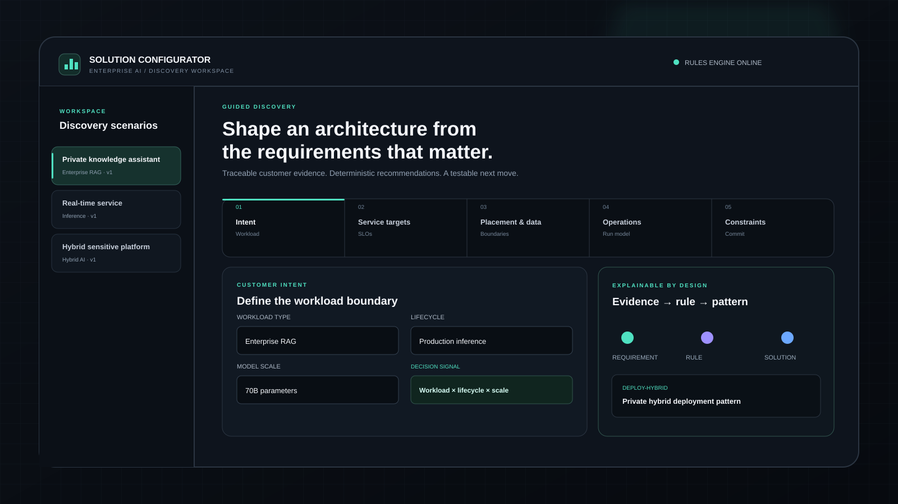
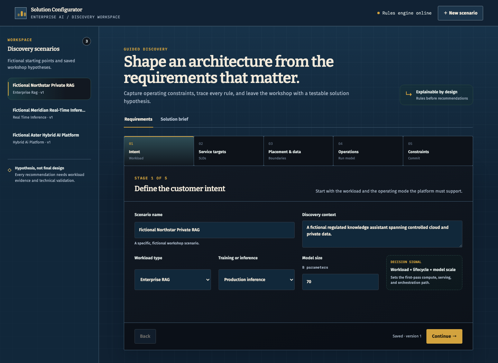
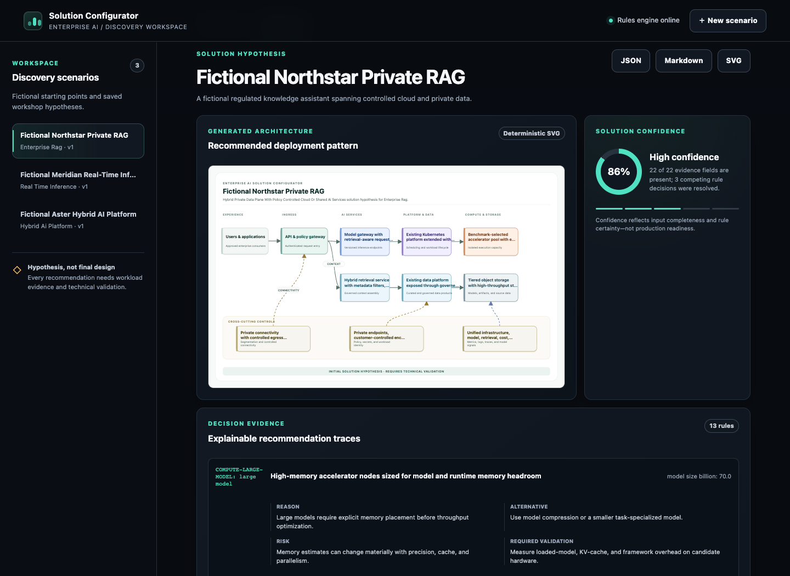
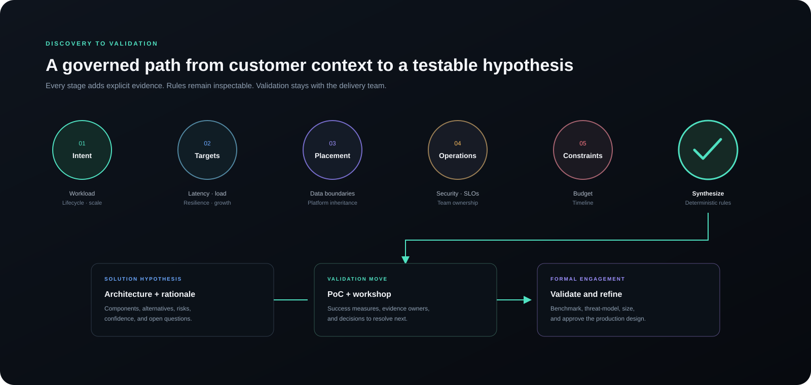
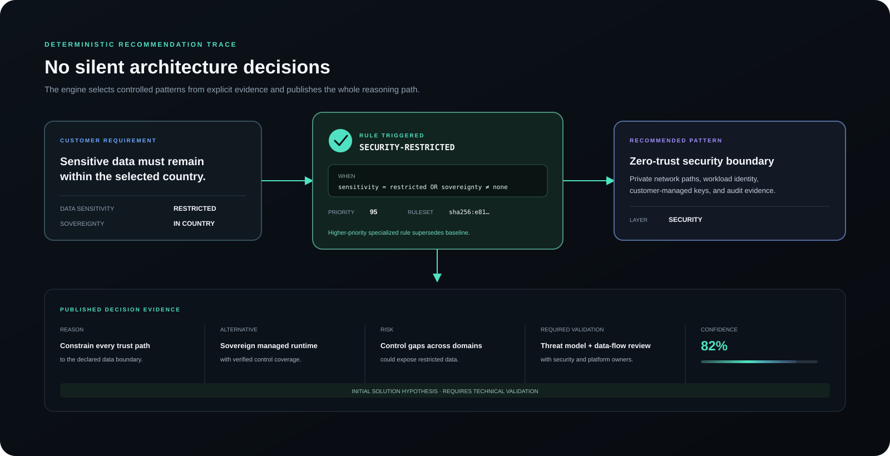

# Enterprise AI Solution Configurator

[](https://github.com/daetan999/ai-infra-solution-configurator/actions/workflows/ci.yml)
[](https://www.python.org/)
[](https://fastapi.tiangolo.com/)
[](LICENSE)

Translate discovery requirements into an explainable AI infrastructure solution hypothesis, an
auditable rule trace, and a downloadable architecture diagram.



## Portfolio role

This product turns the sizing and discovery stages of an enterprise AI opportunity into a structured
solution workshop. It helps a technical seller or architect connect workload, governance, placement,
resilience, operations, budget, and timeline evidence to a coherent first-pass architecture.

It does not use a model to invent the architecture. A deterministic rule catalog produces the
recommendations; every output retains its trigger, rationale, alternative, risk, and validation need.

> Recommendations are initial solution hypotheses. They support discovery and workshops, require
> technical validation, and do not replace a formal architecture review.

## Product evidence





Generated examples come from the same controlled renderer used by the application:

- [Private enterprise RAG architecture](docs/assets/private-enterprise-rag-architecture.svg)
- [Hybrid sensitive-data AI architecture](docs/assets/hybrid-sensitive-ai-architecture.svg)

## What the application implements

- A five-stage guided requirements workflow covering workload, data governance, placement, existing
  platforms, resilience, security, operations, budget, timeline, and growth.
- Strict validation for bounded fields and contradictory placement or lifecycle inputs.
- A versioned deterministic rules engine covering compute, accelerators, orchestration, serving,
  networking, storage, data, retrieval or features, security, identity, observability, resilience,
  deployment, and migration.
- Explainable rule lineage for every recommendation.
- Confidence deductions, primary risks, assumptions, open questions, PoC measures, and a recommended
  next workshop.
- Immutable assessment runs so an earlier workshop output does not change when a scenario or ruleset
  evolves.
- A controlled, accessible SVG architecture generator with no arbitrary markup or external assets.
- JSON and Markdown solution briefs plus SVG diagram downloads.
- Three fictional scenarios: private enterprise RAG, low-latency real-time inference, and a hybrid
  platform for sensitive data.

## Workflow



1. **Capture** the requirement evidence and current environment.
2. **Validate** boundaries and reject contradictions before evaluation.
3. **Evaluate** stable rules in deterministic priority order.
4. **Trace** each architecture choice back to its requirement and rule.
5. **Visualize** only allowlisted solution components in a controlled SVG.
6. **Qualify** risks, missing evidence, and confidence deductions.
7. **Plan** a bounded PoC and the next specialist workshop.
8. **Export** the stored assessment run as JSON, Markdown, or SVG.

## Explainability contract



Each recommendation exposes:

| Field | Decision value |
|---|---|
| Customer requirement | Evidence considered by the rule |
| Rule triggered | Stable rule ID and condition |
| Recommendation | Component or architecture pattern |
| Reason | Why the evidence supports the pattern |
| Alternative | A viable option and when to use it |
| Risk | The primary trade-off introduced |
| Required validation | The measurement or review needed before commitment |

Confidence measures input completeness—not solution correctness. See
[rules and guardrails](docs/rules-and-guardrails.md) for the conflict policy and decision boundary.

## Quick start

Requirements: Python 3.12+.

```bash
python -m venv .venv
source .venv/bin/activate
make install
make dev
```

Open `http://127.0.0.1:8000`. Fictional demos seed by default. To use a separate local database:

```bash
CONFIGURATOR_DB=data/local-configurator.db SEED_DEMO_DATA=true make dev
```

### Docker

```bash
docker build -t solution-configurator .
docker run --rm -p 8000:8000 -e SEED_DEMO_DATA=true solution-configurator
```

Or run `docker compose up --build` for a persistent local SQLite volume.

## API

Responses use `{success, data, error, meta}` envelopes. Downloads return their native media type.

| Method | Path | Purpose |
|---|---|---|
| `GET` | `/api/health` | Health check |
| `GET`, `POST` | `/api/scenarios` | List or create scenarios |
| `GET`, `PUT`, `DELETE` | `/api/scenarios/{id}` | Read, revise, or delete a scenario |
| `GET` | `/api/scenarios/{id}/runs` | List immutable assessment runs |
| `GET` | `/api/runs/{run_id}` | Read one historical run |
| `GET` | `/api/scenarios/{id}/diagram.svg` | Download the latest architecture |
| `GET` | `/api/scenarios/{id}/export?format=json\|markdown` | Export the latest solution brief |

Interactive API documentation is available at `/api/docs` while the application is running.

## Verification

```bash
make lint
make test
make coverage
node --check static/app.js
docker build -t solution-configurator .
```

The test suite covers schema boundaries, rule precedence, every recommendation area, confidence,
diagram safety and determinism, snapshot persistence, API errors, exports, fictional demos, the main
workflow, and the rendered-interface contract. CI enforces linting, browser-script syntax, an 80%
branch-coverage floor, and a clean-checkout container build. The application is deployed from its
repository checkout or container image; it is not published as a standalone Python wheel.

## Architecture and boundaries

The modular monolith keeps three deep seams:

```text
validated requirements
        │
        ▼
versioned rules ──► immutable assessment run ──► JSON / Markdown brief
                                      │
                                      ▼
                         allowlisted blueprint ──► inert SVG
```

Read [architecture](docs/architecture.md) for the persistence and rendering invariants.

## Limitations

- The included solution patterns are generic and vendor-neutral; they are not a bill of materials.
- No bundled throughput, latency, security, availability, or cost statement is a benchmark or quote.
- The tool does not inspect an existing estate, validate workload compatibility, or prove recovery.
- Authentication, tenant isolation, TLS, rate limits, and central audit retention are outside this
  local single-user demonstrator.
- Shared or production use requires formal security, identity, network, data-governance, operations,
  and architecture review.

## Public-data boundary

All bundled scenarios and outputs are fictional or illustrative. Do not enter customer identifiers,
confidential requirements, proprietary configurations, credentials, production telemetry, internal
project IDs, supplier quotes, or contract prices into a public demonstration.

## Repository map

```text
app/
  schemas.py       Strict HTTP requirements contract
  rules.py         Versioned rule catalog
  engine.py        Deterministic assessment assembly
  repository.py    SQLite scenarios and immutable assessment runs
  architecture.py  Allowlisted blueprint construction
  diagram.py       Accessible inert SVG renderer
  exports.py       JSON and Markdown solution briefs
  main.py          FastAPI composition and routes
templates/         Guided workspace
static/            Browser behavior and visual system
tests/             Unit, API, integration, safety, and interface contracts
docs/              Architecture, guardrails, testing evidence, visuals, screenshots
```

## License

[MIT](LICENSE)

---

[Part of the Enterprise AI Infrastructure Portfolio](https://github.com/daetan999/technical_resume)
