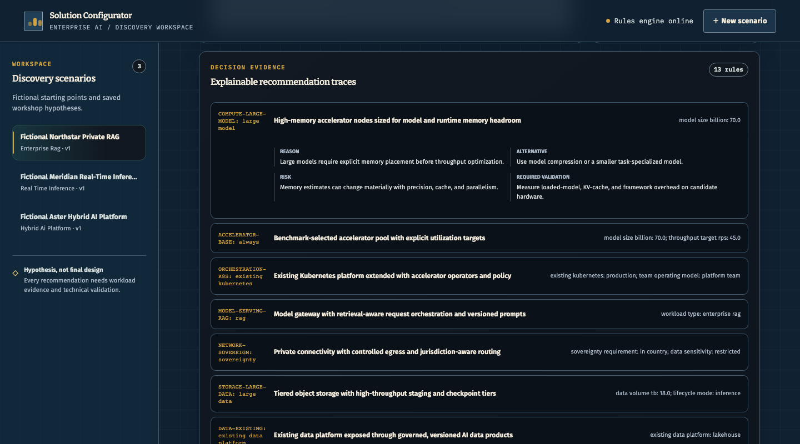
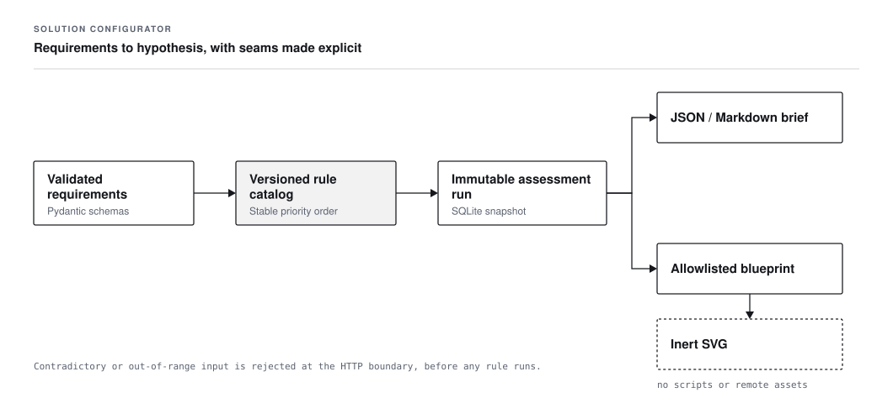

# Enterprise AI Solution Configurator

[](https://github.com/daetan999/ai-infra-solution-configurator/actions/workflows/ci.yml)
[](LICENSE)
[](pyproject.toml)
[](pyproject.toml)
[](pyproject.toml)
[](pyproject.toml)
[](playwright.config.mjs)
[](Dockerfile)
[](https://github.com/daetan999/technical_resume)

Turn discovery requirements into an explainable infrastructure hypothesis, a reviewable rule trace,
and an exportable architecture diagram.


*A seeded private-RAG scenario shown as a generated deployment pattern with input-completeness
confidence. The output is a workshop hypothesis, not an approved design.*

## The decision this supports

Early architecture workshops often mix workload targets, data boundaries, operating constraints, and
delivery pressure without preserving why a recommendation was made. This configurator creates a
structured first pass:

1. Capture the workload, service targets, placement, governance, operations, budget, and timeline.
2. Reject contradictory or out-of-range inputs at the API boundary.
3. Evaluate a versioned deterministic rule catalog in stable priority order.
4. Store an immutable assessment run with the selected rules and evidence.
5. Render an allowlisted architecture diagram and export the same stored result.

The application does not call a language model or conceal recommendations behind a prompt. Each
choice retains its trigger, rationale, alternative, risk, and required validation.

## Product walkthrough

### 1. Capture the requirement evidence


*The five-stage workspace keeps requirement capture separate from the resulting solution brief.
Three fictional scenarios are seeded for local evaluation.*

### 2. Inspect the architecture hypothesis

The solution view combines a controlled SVG diagram, a confidence signal based on evidence
completeness, architecture components, risks, assumptions, open questions, a proposed proof of
concept, and the next workshop. JSON, Markdown, and SVG exports are generated from the stored
assessment run rather than recalculating it.

Generated examples:

- [Private enterprise RAG architecture](docs/assets/private-enterprise-rag-architecture.svg)
- [Hybrid sensitive-data AI architecture](docs/assets/hybrid-sensitive-ai-architecture.svg)

### 3. Challenge each recommendation



*The trace makes the selected rule and its trade-offs visible. Confidence measures input
completeness; it does not certify solution correctness or production readiness.*


## Architecture

The codebase is a local-first FastAPI modular monolith with three explicit seams:



- **HTTP boundary:** Pydantic schemas validate bounded values and contradictory inputs.
- **Decision layer:** versioned rules resolve exclusive candidates by priority and stable rule ID.
- **Persistence:** SQLite stores scenario revisions and immutable assessment snapshots.
- **Rendering:** typed, allowlisted components are escaped into deterministic SVG without scripts,
  remote assets, event handlers, or arbitrary markup.
- **Client:** server-rendered HTML, CSS, and browser JavaScript provide the staged workflow.

See [Architecture](docs/architecture.md), [Rules and guardrails](docs/rules-and-guardrails.md), and
the [workflow map](docs/assets/configuration-workflow.svg) for the invariants behind those seams.

## Run locally

Requirements: Python 3.12+. The browser test suite uses Node.js 24 in CI.

```bash
python -m venv .venv
source .venv/bin/activate
make install
make dev
```

Open `http://127.0.0.1:8000`. `make dev` enables the fictional demo scenarios. To persist data at a
specific local path:

```bash
CONFIGURATOR_DB=data/local-configurator.db SEED_DEMO_DATA=true make dev
```

### Docker

```bash
docker build -t solution-configurator .
docker run --rm -p 8000:8000 -e SEED_DEMO_DATA=true solution-configurator
```

`docker compose up --build` uses a persistent local SQLite volume.

## API surface

Responses use `{success, data, error, meta}` envelopes. Downloads return their native media type.
Interactive OpenAPI documentation is available at `/api/docs` while the app is running.

| Method | Path | Purpose |
|---|---|---|
| `GET` | `/api/health` | Health check |
| `GET`, `POST` | `/api/scenarios` | List or create scenarios |
| `GET`, `PUT`, `DELETE` | `/api/scenarios/{id}` | Read, revise, or delete a scenario |
| `GET` | `/api/scenarios/{id}/runs` | List immutable assessment runs |
| `GET` | `/api/runs/{run_id}` | Read one historical run |
| `GET` | `/api/scenarios/{id}/diagram.svg` | Download the latest architecture |
| `GET` | `/api/scenarios/{id}/export?format=json\|markdown\|svg` | Export the latest brief or diagram |

## Verification

```bash
make lint
make test
node --check static/app.js
npm ci
npx playwright install chromium
make e2e
docker build -t solution-configurator .
```

The Python suite covers schema boundaries, rule selection and precedence, persistence, API behavior,
exports, diagram safety, fictional data, and the discovery-to-assessment workflow. CI also enforces
an 80% branch-coverage floor, checks the browser script, runs two Playwright journeys, and builds the
container from a clean checkout.

## Scope and limitations

- Included patterns are generic and vendor-neutral; they are not a bill of materials or quote.
- No bundled throughput, latency, security, availability, recovery, or cost statement is a benchmark.
- The tool does not inspect an existing estate or prove workload, network, storage, or recovery fit.
- Authentication, authorization, tenant isolation, TLS, request limits, and centralized audit
  retention are outside this local single-user demonstrator.
- Shared or production use requires formal security, identity, network, data-governance, operations,
  and architecture review.

All bundled scenarios and outputs are fictional. Do not enter customer identifiers, confidential
requirements, credentials, production telemetry, internal project IDs, supplier quotes, or contract
prices into a public demonstration.

## Repository map

```text
app/        Validation, rules, assessment assembly, persistence, exports, and HTTP routes
templates/  Guided workspace
static/     Browser behavior and blueprint visual system
tests/      Unit, API, integration, safety, interface, and browser contracts
docs/       Architecture notes, guardrails, workflow diagrams, and showcase assets
```

## License

[MIT](LICENSE)

---

[Enterprise AI Infrastructure Portfolio](https://github.com/daetan999/technical_resume)
