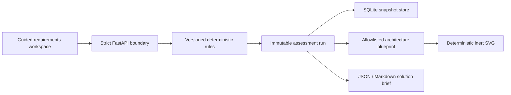

# Architecture

The configurator is a local-first FastAPI modular monolith. It separates requirement validation,
deterministic decision logic, immutable assessment snapshots, and controlled SVG rendering so each
output can be inspected without an external service.

## Request path

1. Pydantic validates the scenario and rejects contradictory or out-of-range requirements.
2. The rules engine derives facts and evaluates a versioned, ordered rule catalog.
3. Each architecture area receives one explainable recommendation with alternatives, risks, and
   required validation.
4. The repository stores the requirements and assessment as an immutable run tied to the scenario
   version.
5. The blueprint builder maps only approved component identifiers into nodes and edges.
6. The renderer produces inert SVG from that typed blueprint.
7. JSON, Markdown, and SVG exports read the stored run rather than recalculating it.

## Audit invariants

- The same canonical requirements and ruleset produce the same structural assessment.
- Historical runs are never recalculated on read.
- Rule IDs, ruleset version, input digest, and recommendation traces are stored with each run.
- Confidence describes evidence completeness, not architectural correctness.
- Rules cannot emit SVG markup; the renderer accepts only allowlisted blueprint components.
- No external API, cloud credential, customer dataset, or model endpoint is required.

## Deployment boundary

The repository is suitable for a single-user local workshop demonstrator. A shared deployment would
still require authentication, authorization, tenant isolation, TLS termination, request limits,
centralized audit retention, and an approved data-classification process.
